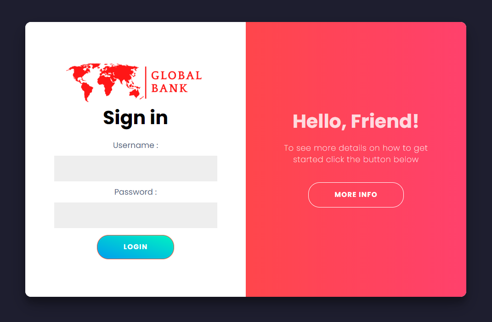

# Final Project Ironhack Bootcamp Java - Global Bank App


# Global Bank App

* [Goal](#goal)

* [How it works](#how-it-works)

* [Security](#security)

* [Methodology](#methodology)

* [Tools](#tools)


## <a name="goal"></a>Goal

A Global Bank is a banking system for transfer, pay and manage your accounts.

This new project was generated with [Angular CLI](https://github.com/angular/angular-cli) version 9.1.3.

## <a name="how-it-works"></a>How it works

STEPS TO RUN THE PROJECT

1. Download the **Final Project** repository on your local computer

3. You will run all service with mvn spring-boot:run for each service.

2. You will need to execute this command:
```npm install```
and then
```ng serve``` in order to execute the project

3. Navigate to `http://localhost:4200/`.




## <a name="security"></a>Security
* We implemented BasicAuth security on the edge service for classic credential indentification.

All routes are secure. It is mandatory to be logged in the application. So even if you put directly the HTTP route without being logged in you will be redirected to the login page.

There are two users you can use:

````
user: admin
password: admin

user: user
password: admin
````


## <a name="methodology"></a>Methodology

The front was created using a Bootstrap template.

We implemented:
- navbar (user display with a logout option)
- sidebar
- error and success popup notifications
- reactive forms with validators
- dynamic graphs for the reports
- App logo favicon

## <a name="tools"></a>Tools used
- IntelliJ
- Spring
- MySQL
- Postman
- Heroku
- PostgreSQL
- Figma (for interface design)
- Angular
- Bootstrap
